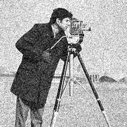
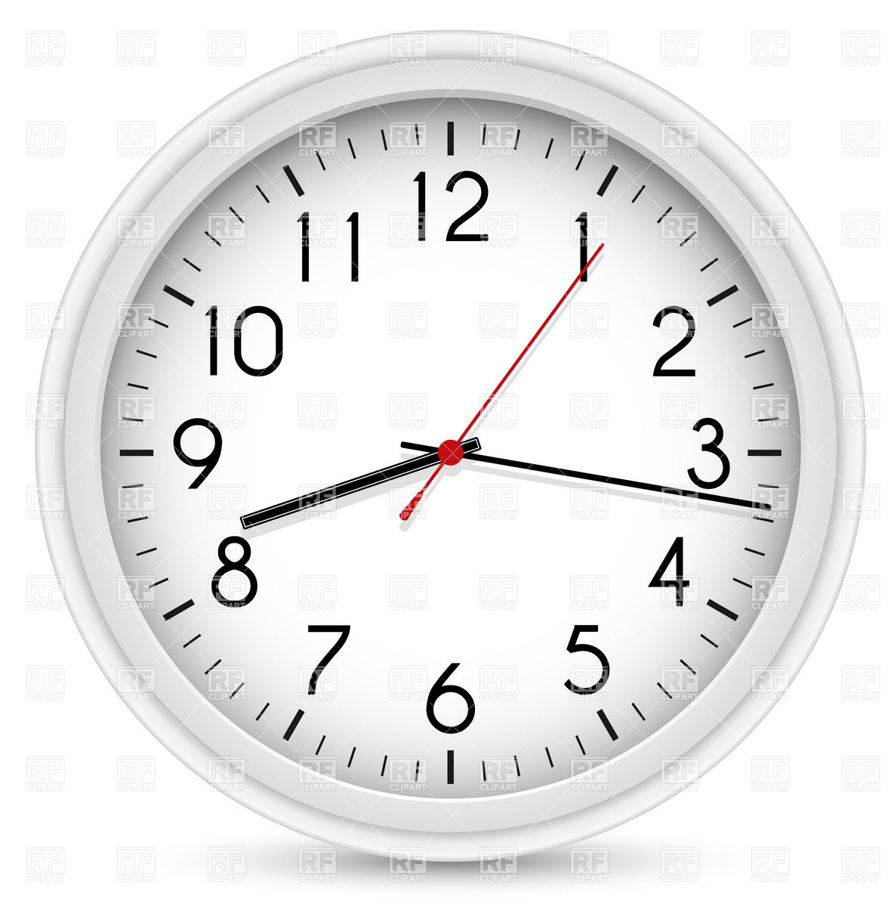
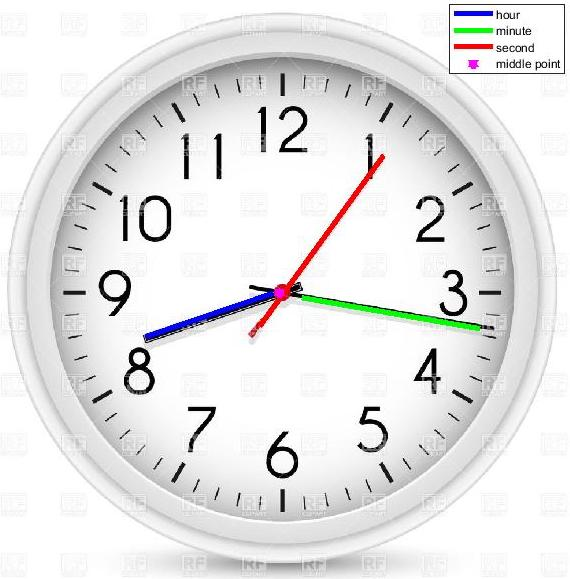
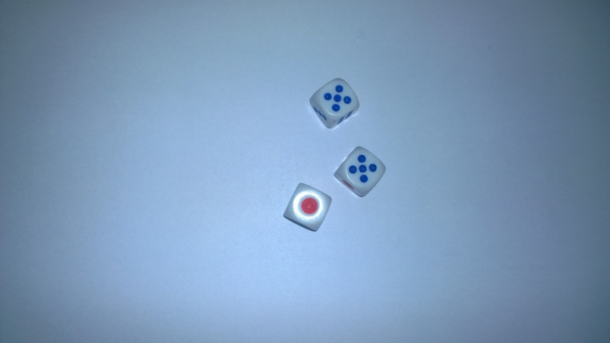
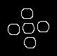
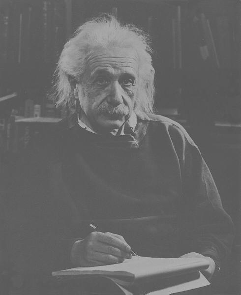
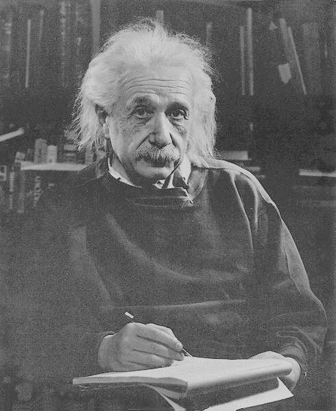
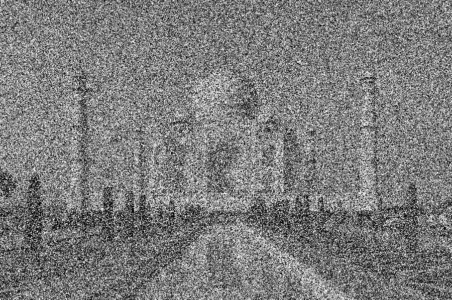
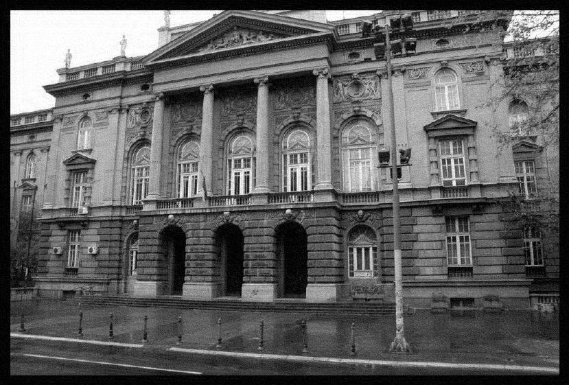

# Image Processing
Digital image processing Algorithms and their application to the real problems.

## Canny Edge Detector

There is Canny Edge Detector implemented from scratch. You can see one of the results below.

| **Image** | **Edges** |
|:---:|:---:|
| | |

## Time detection

If you ever needed a program that would tell you what's the time, today is your lucky day. 

| **Image** | **Detected Needles** | **HH:MM:SS** |
|:---:|:---:|:---:|
| | |08:17:06|

## Dice detection

If you ever played a game with dice and needed program that would quickly tell you your score, today is your lucky day. 

| **Image** | **Detected Dice** | **Dice Circles** |
|:---:|:---:|:---:|
| | | |

## What image improvement methods can I find here?

Here are some of the results of methods implemented in this project.

| **Before** | **After** | **Method** |
|:---:|:---:|:---:|
|  | |Histogram Equalization|
|  | |Clip Limit Histogram Equalization|
|  | |Adaptive Median Filter|
|  | |Wiener Filter|
|  | |Non-local Means|
|  | |2D Notch Filter|

## How to run the tests?

To run any test simply go to the directory of the project task you want to test, and type 'test' in the Matlab shell. Note that for some tests you have to have Matlab version 2017 and above.

  ```shell
  test
  ```
