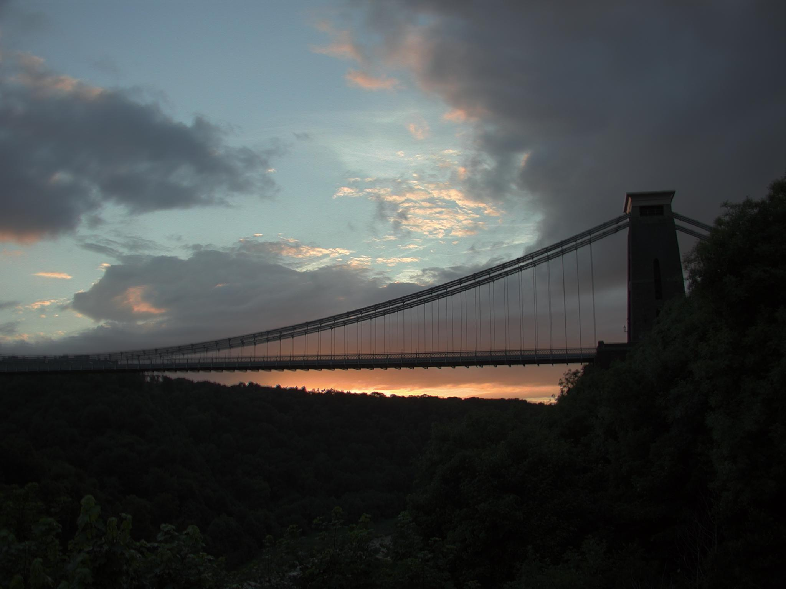
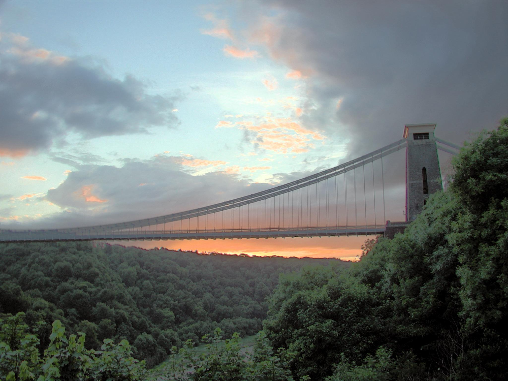
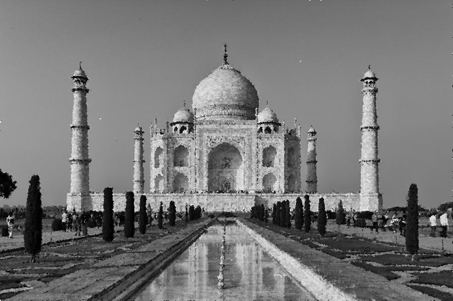
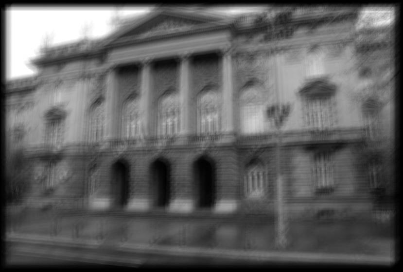
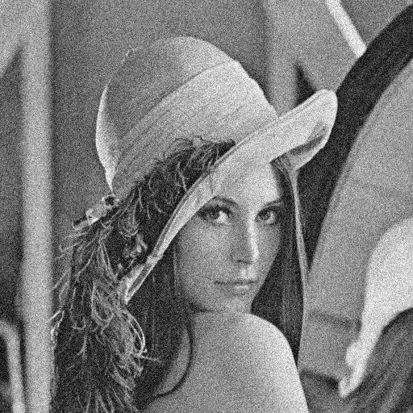
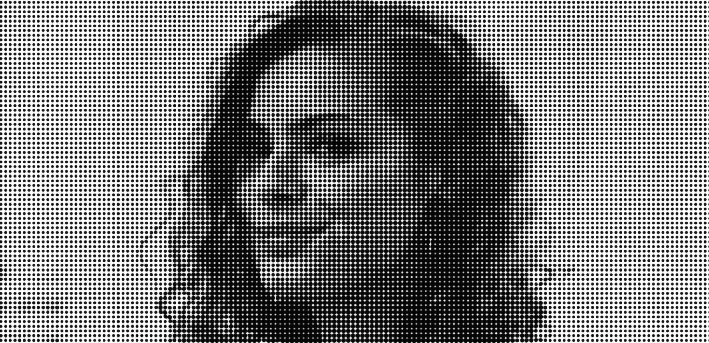
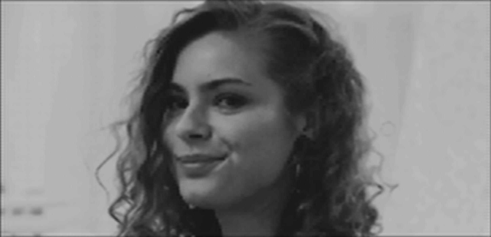

# Image Processing
Digital image processing Algorithms and their application to the real problems.

## What image improvement methods can I find here?

Here are some of the results of methods implemented in this project.

| **Before** | **After** | **Method** |
|:---:|:---:|:---:|
|  | |Histogram Equalization|
|  | |Clip Limit Histogram Equalization|
|  | |Adaptive Median Filter|
|  | |Wiener Filter|
|  | |Non-local Means|
|  | |2D Notch Filter|

